# diss
Website Vulnerability Scanning Site(XSS, Sql Injection, Path tarversal, OS Command Injection etc ...)

# How to use
1. app.js를 실행하여 백엔드 서버를 작동시킴
2. 해당하는 url로 접속후 원하는 공격 카테고리로 접근함(xss의 경우 fast, accurate 두가지 버전을 제공함 *fast의 경우 request 모듈만을 사용 -> 빠른 스캐닝 가능 but 오탐률 높아짐 *accurate의 경우 브라우저 컨트롤이 가능한 모듈을 사용 -> 스캐닝 느림 but 오탐률이 낮아짐)
3. 점검을 하고 싶은 url을 입력 후 돋보기 버튼을 누름
4. 스캐닝이 끝나면 결과창이 나옴

# Images
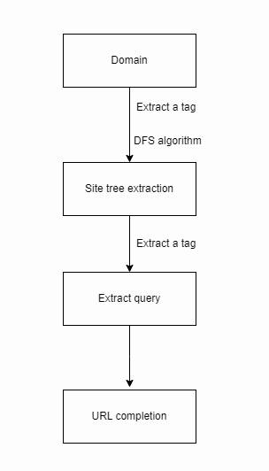
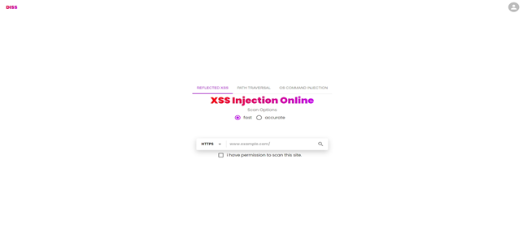
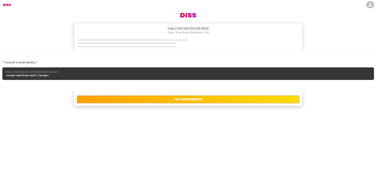
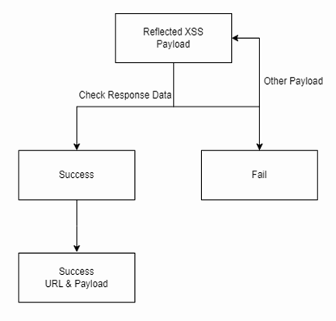
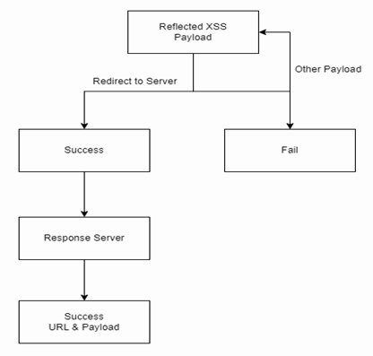
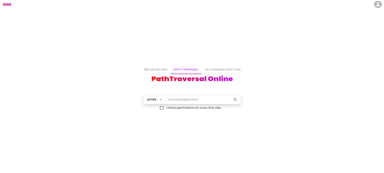
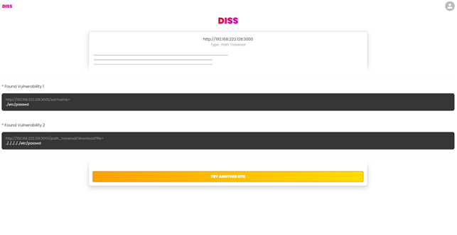
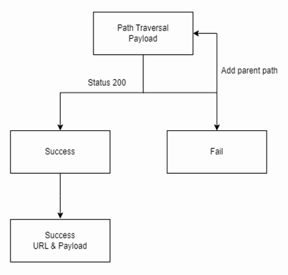
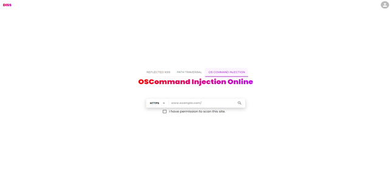
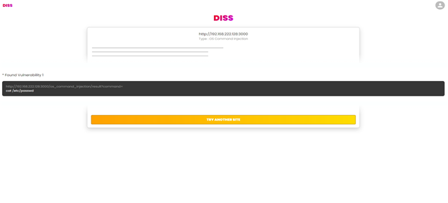
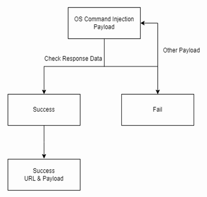
